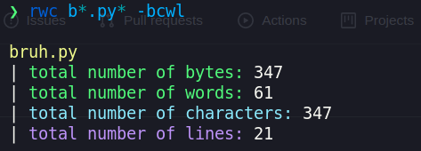

# rwc the better linux wc

a better linux `wc` made in rust!

## installation
make sure you have cargo installed and then run  
`cargo install rwc-rs`  

to update it run the same command  

### usage

rwc-rs <file_path>  
`-b or --bytes` to show the total number of bytes  
`-c or --chars` to show the total number of charcters  
`-w or --words` to show the total number of words  
`-l or --lines` to show the total number of lines  

### tool pic

